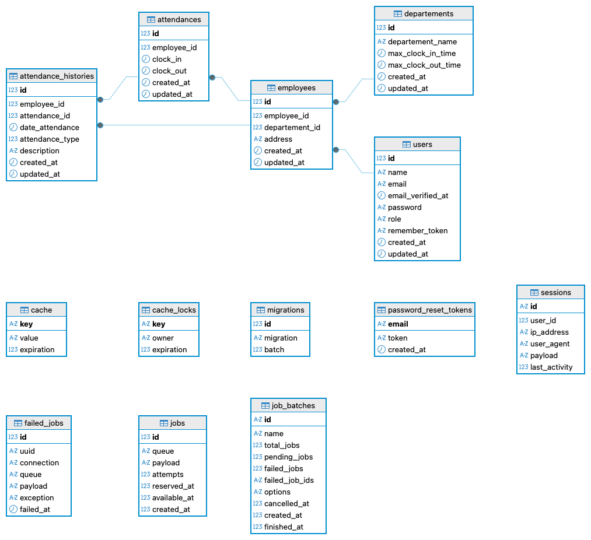

# Fleetify Absensi System

## Overview
Fleetify Absensi System adalah aplikasi untuk mencatat kedisiplinan karyawan secara manual. Sistem ini memungkinkan pencatatan absensi masuk dan keluar karyawan, pengelompokan berdasarkan departemen, serta menampilkan laporan ketepatan absensi.  

**Link Aplikasi:** [http://fleetify.frecode.my.id](http://fleetify.frecode.my.id)
### 🔑 Akun Login (Demo)
- **Email:** `admin@gmail.com`  
- **Password:** `password123` 
**Tujuan Sistem:**  
- Mempermudah monitoring absensi karyawan  
- Memudahkan evaluasi kedisiplinan berdasarkan waktu masuk & keluar  

---

## Fitur Utama
1. CRUD Karyawan  
2. CRUD Departemen  
3. POST Absen Masuk  
4. PUT Absen Keluar  
5. GET List Log Absensi Karyawan (dengan filter tanggal & departemen, dan cek ketepatan waktu)  

---

## Teknologi & Arsitektur
- **Backend:** Laravel  
- **Frontend:** Laravel dengan template **SB Admin 2** dan menggunakan **Laravel Breeze** untuk autentikasi  
- **Database:** MySQL  

---

## 🔐 Autentikasi dengan Laravel Breeze
Fleetify Absensi menggunakan **Laravel Breeze** sebagai sistem autentikasi default.  
Dengan Breeze, sistem ini sudah mendukung:
- Login & Register pengguna  
- Logout  
- Reset password (menggunakan `password_reset_tokens`)  
- Session management (tabel `sessions`)  

> 📌 **Catatan:** Aplikasi ini hanya mengaktifkan login untuk **Admin** dan **Karyawan**.  
> Role ditentukan di tabel `users.role`.  

---

## ERD


---


## Cara Menggunakan / User Guide

### Admin:
1. Login ke sistem menggunakan akun admin  
2. Tambah / edit / hapus karyawan  
3. Tambah / edit / hapus departemen  
4. Lihat laporan absensi dengan filter tanggal & departemen  

### Karyawan:
1. Login ke sistem menggunakan akun karyawan  
2. Pilih **Riwayat Absensi**  
3. Pilih **Absen Masuk / Absen Keluar**  

---

## Catatan Khusus
- Sistem absensi bersifat manual karena **tidak ada ketentuan khusus** 
- Laporan absensi dapat difilter berdasarkan tanggal dan departemen  

---

## Setup / Instalasi

1. Clone repository:  
```bash
git clone https://github.com/fremasadi/fleetify-tes
